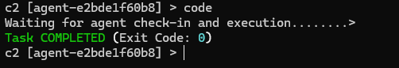
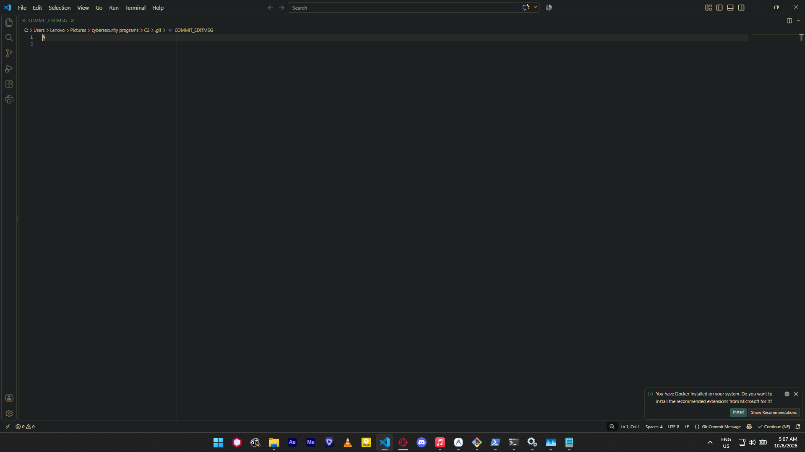
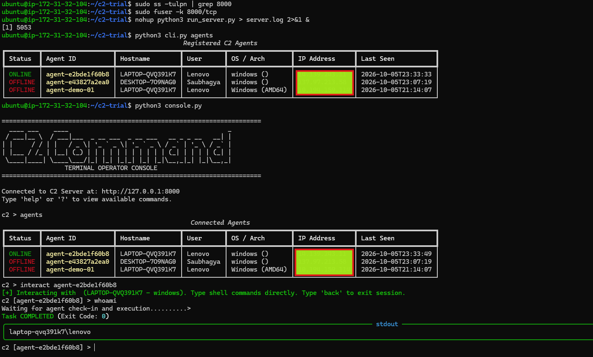
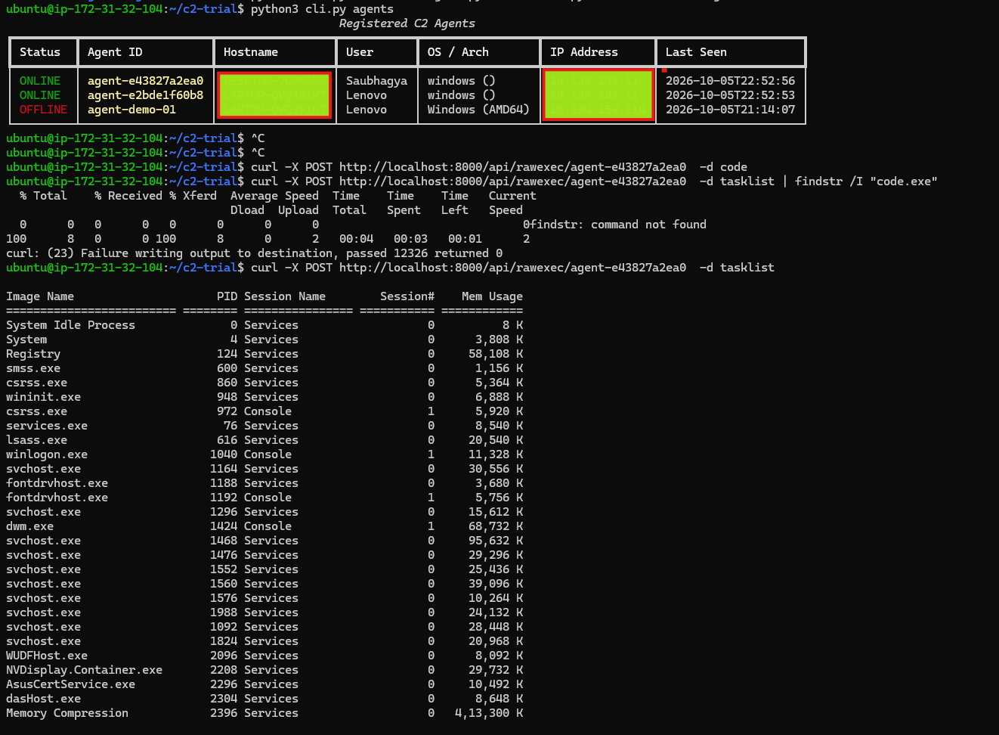
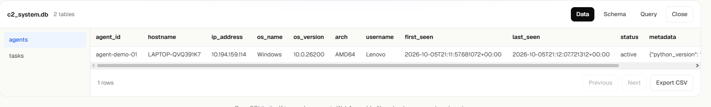
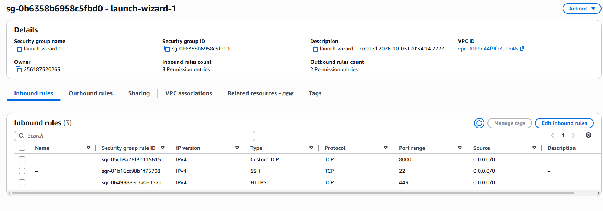
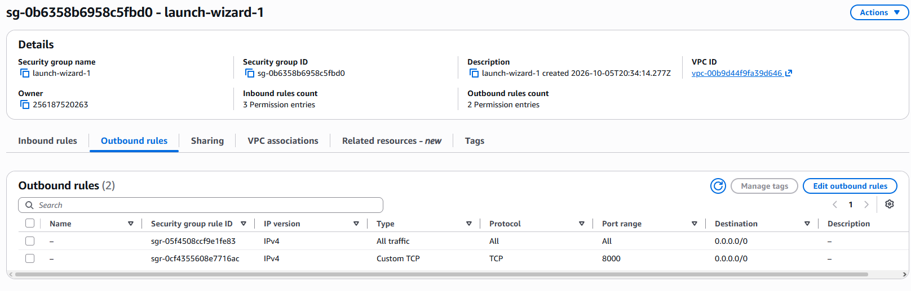

# Minimal C2 Server

An asynchronous, headless remote command execution and task queuing architecture designed for remote system management across firewalled and NAT/CGNAT networks.

The server maintains a thread-safe SQLite database queue of shell commands. Target agents periodically initiate outbound HTTP/HTTPS check-ins (beaconing) to retrieve assigned commands, execute them silently as background processes, and report back process exit codes, stdout, and stderr. It was built to eliminate the need for port forwarding or complex VPN setups, operating entirely over SSH without requiring a web GUI.

## 📂 Project Structure

To run the server on your AWS EC2 instance, you only need these 6 files:

```text
c2-server/
├── server/
│   ├── __init__.py       # Server package initialization
│   ├── config.py         # Server configuration (host, port, DB path)
│   ├── db.py             # SQLite database layer & task queue storage
│   └── app.py            # Headless FastAPI REST API endpoints
├── run_server.py         # Main server launcher script
├── console.py            # Interactive SSH terminal console
└── cli.py                # Single-line operator CLI tool
```

## 🚀 Key Features

* **Outbound Beaconing (NAT / CGNAT Traversal):** Agents initiate outbound connections over standard HTTP/HTTPS ports (80/443), making them immune to target network firewalls or CGNAT routers.
* **Headless SSH-First Console:** Full command-and-control operations are driven via terminal tools (`console.py`, `cli.py`, or direct `curl` endpoints) inside SSH sessions.
* **Atomic Task Queueing (FIFO):** Backed by SQLite in WAL (Write-Ahead Logging) mode for high concurrency, ensuring tasks are dispatched reliably and never executed twice.
* **Direct curl Terminal One-Liners:** Includes a `/api/rawexec/{agent_id}` endpoint for piping plain-text stdout directly into terminal prompts.

## 🛠️ Tech Stack

* **Server Backend:** Python 3.12, FastAPI, Uvicorn, SQLite3 (WAL Mode), Pydantic.
* **Operator Tools:** Python, `rich` (terminal formatting), `requests`, `cmd` standard library.
* **Infrastructure & Deployment:** AWS EC2 (Ubuntu 24.04 LTS), Linux systemd.

## ⚙️ Installation and Setup Instructions

### A. Server Setup (AWS EC2 / Linux VPS)

**1. Configure AWS Security Group**

* Open Custom TCP Port 8000 → Source: `0.0.0.0/0`
* Open SSH Port 22 → Source: `My IP`

**2. Install Server Dependencies**

```bash
sudo apt update && sudo apt install -y python3-pip python-is-python3
pip install fastapi uvicorn requests rich
```

**3. Enable 24/7 Background System Service**

```bash
sudo tee /etc/systemd/system/c2-server.service > /dev/null << 'EOF'
[Unit]
Description=Headless C2 Server Daemon
After=network.target

[Service]
Type=simple
User=ubuntu
WorkingDirectory=/home/ubuntu/C2
ExecStart=/usr/local/bin/python3 /home/ubuntu/C2/run_server.py
Restart=always
RestartSec=5

[Install]
WantedBy=multi-user.target
EOF

sudo systemctl daemon-reload
sudo systemctl enable --now c2-server
```

### B. How Any Custom Agent Connects to Port 8000

Yes! Any client or custom agent written in any programming language (Go, C/C++, C#, Rust, Python, PowerShell, or Bash) can interact with port 8000.

The server operates over standard HTTP REST APIs with JSON payloads. Any agent only needs to perform 3 simple HTTP POST requests:

**1. Register with Server**

* **Endpoint:** `POST http://<SERVER_IP>:8000/api/agent/register`
* **JSON Body:**
```json
{
  "agent_id": "custom-agent-01",
  "hostname": "TARGET-PC",
  "os_name": "Windows",
  "username": "admin"
}
```

**2. Check-In / Poll for Tasks**

* **Endpoint:** `POST http://<SERVER_IP>:8000/api/agent/checkin`
* **JSON Body:**
```json
{
  "agent_id": "custom-agent-01"
}
```
* **Server Response (If tasks are queued):**
```json
{
  "status": "ok",
  "tasks": [
    {
      "id": "550e8400-e29b-41d4-a716-446655440000",
      "command": "ipconfig /all"
    }
  ]
}
```

**3. Return Command Execution Output**

* **Endpoint:** `POST http://<SERVER_IP>:8000/api/agent/result`
* **JSON Body:**
```json
{
  "agent_id": "custom-agent-01",
  "task_id": "550e8400-e29b-41d4-a716-446655440000",
  "status": "completed",
  "exit_code": 0,
  "stdout": "Windows IP Configuration...",
  "stderr": ""
}
```

### C. Operator CLI Usage (Over SSH)

SSH into your server and manage agents:

```bash
# List all connected agents
python3 cli.py agents

# Execute a command and wait for output
python3 cli.py exec <AGENT_ID> "whoami" --wait

# Run a local script file on target
python3 cli.py exec-file <AGENT_ID> script.ps1 --wait

# Quick curl terminal one-liner
curl -X POST http://localhost:8000/api/rawexec/<AGENT_ID> -d "ipconfig /all"

# Interactive Terminal Console
python3 console.py
```
## 📂 OUTPUT









